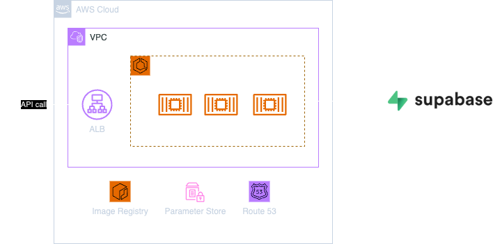
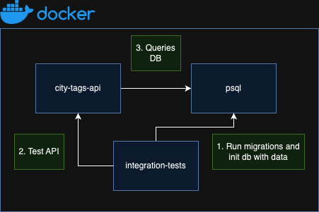

# City Tags API


## Introduction

API to be able to consume tags on cities, for example if the humidity is "moderate" or "humid" or if the city is "small" or "big". Built with Go (Chi), Pulumi, AWS and Supabase.

## Architecture

<div style="text-align: center;">
  
</div>

A DNS record with an SSL certificate is used to be able to set up a connection through HTTPS. An Application Load Balancer (ALB) is registered as a target of this registry. The ALB redirects traffic to the ECS Service where the Go API is deployed. The ECS Service makes use of SSM Parameter Store for environment variables and of ECR to store the different container images of the API. Finally, the API queries the database, in this case Supabase, where the serverless Postgres database is.

## Requirements

- You must own an AWS account and have an Access Key to be able to authenticate.
- Go v1.22.1
- Tools:
    - psql==14.12
    - goose==3.20.0
    - air==1.52.1
    - swag==1.16.3
    - pre-commit==3.7.1
    - bumpversion==1.0.1

## Testing

### Unit tests

The unit tests developed in this repo test business logic only, testing that had external dependencies is done in the integration tests. To run the unit tests you can run the following command:

```bash
make unit-tests
```

These tests are executed everytime a commit is created as part of the pre-commit workflow and also in the PR checks before merging.

### Integration tests

These tests have been developed to test all the functionality that interacts with the database. A test environment is set up with Docker Compose with the following containers:

- city-tags-api: API developed with Go.
- psql: postgres database that will simulate the Supabase database.
- integration-tests: container where the integration tests will run. Before running the tests in runs the goose migrations and initializes the database with test data.

<div style="text-align: center;">
  
</div>

To run the integration tests you can run the following command:

```bash
make integration-tests
```

These tests are executed everytime a commit is created as part of the pre-commit workflow and also in the PR checks before merging.
